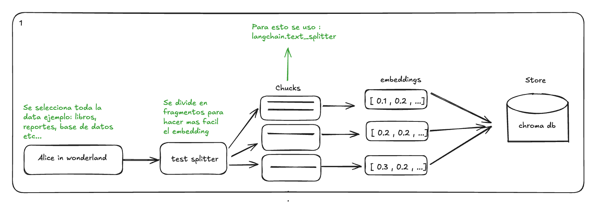
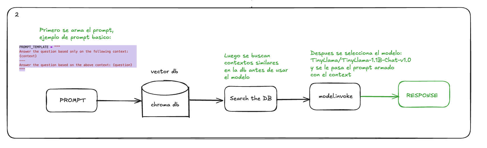

# 📚 LLM + RAG con LangChain, Chroma y HuggingFace

Este proyecto implementa un **sistema de Recuperación Aumentada por Generación (RAG)** usando **LangChain**, **ChromaDB** y modelos de **HuggingFace**. 
La informacion y codigo fuente esta en la carpeta summary , la cual toma el libro de alicia en el pais de las maravillas para alimentar el modelo 


La idea principal es:  
1. **Dividir documentos** en chunks manejables.  
2. **Crear embeddings** con un modelo de sentence-transformers.  
3. **Almacenar y consultar** en una base vectorial (Chroma).  
4. **Usar un modelo LLM** para responder preguntas basado en contexto relevante.  

## 🚀 Instalación

1. Clona este repositorio:  
   ```bash
   git clone https://github.com/tu_usuario/tu_repo.git
   cd tu_repo

2.  conda create -n llm-env python=3.11 -y
    conda activate llm-env

3. pip install -r requirements.txt

4. Diagramas utiles para entender el proyecto

   
   


## ▶️ Uso

1. Crear la base de datos de vectores : python create_database.py

2. Hacer consultas: python query_data.py "How does Alice meet the Mad Hatter?"


